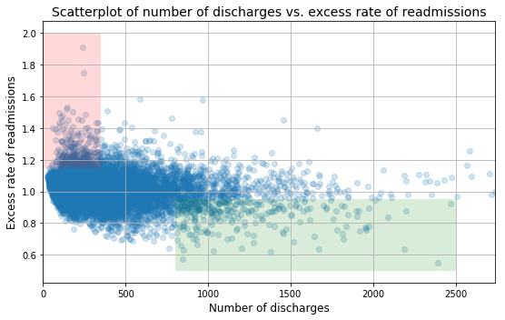
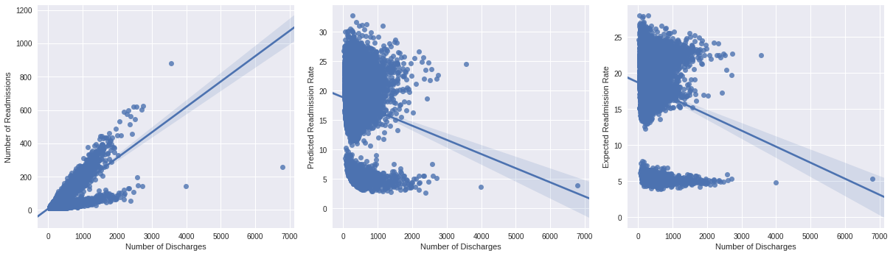
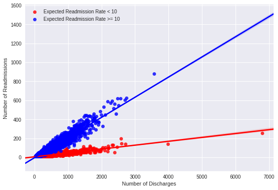
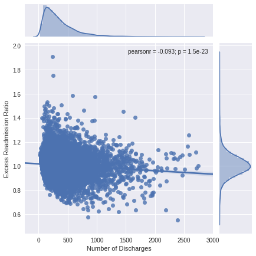
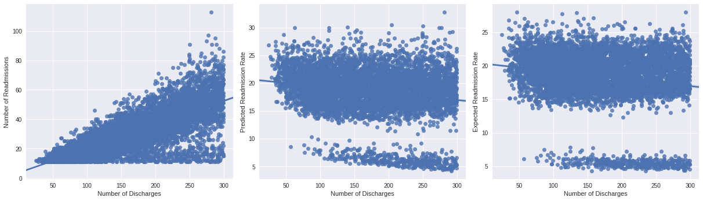
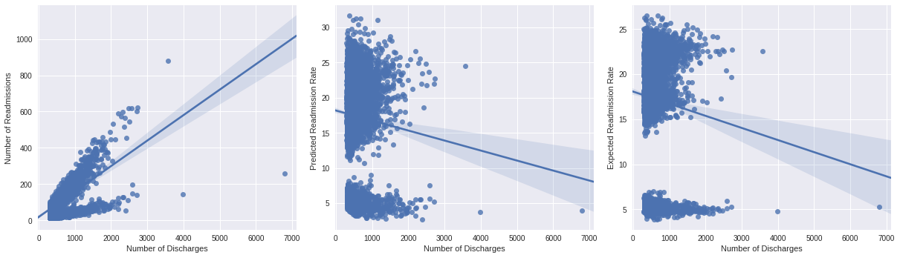

# Hospital Readmissions Data Analysis and Recommendations for Reduction

### Background
In October 2012, the US government's Center for Medicare and Medicaid Services (CMS) began reducing Medicare payments for Inpatient Prospective Payment System hospitals with excess readmissions. Excess readmissions are measured by a ratio, by dividing a hospital’s number of “predicted” 30-day readmissions for heart attack, heart failure, and pneumonia by the number that would be “expected,” based on an average hospital with similar patients. A ratio greater than 1 indicates excess readmissions.

### Exercise Directions

In this exercise, you will:
+ critique a preliminary analysis of readmissions data and recommendations (provided below) for reducing the readmissions rate
+ construct a statistically sound analysis and make recommendations of your own 

More instructions provided below. Include your work **in this notebook and submit to your Github account**. 

### Resources
+ Data source: https://data.medicare.gov/Hospital-Compare/Hospital-Readmission-Reduction/9n3s-kdb3
+ More information: http://www.cms.gov/Medicare/medicare-fee-for-service-payment/acuteinpatientPPS/readmissions-reduction-program.html
+ Markdown syntax: http://nestacms.com/docs/creating-content/markdown-cheat-sheet
****


```python
%matplotlib inline

import pandas as pd
import numpy as np
import matplotlib.pyplot as plt
import bokeh.plotting as bkp
from mpl_toolkits.axes_grid1 import make_axes_locatable
```


```python
# read in readmissions data provided
hospital_read_df = pd.read_csv('data/cms_hospital_readmissions.csv')

print(hospital_read_df.columns)
```

    Index(['Hospital Name', 'Provider Number', 'State', 'Measure Name',
           'Number of Discharges', 'Footnote', 'Excess Readmission Ratio',
           'Predicted Readmission Rate', 'Expected Readmission Rate',
           'Number of Readmissions', 'Start Date', 'End Date'],
          dtype='object')


****
## Preliminary Analysis


```python
# deal with missing and inconvenient portions of data 
pd.options.mode.chained_assignment = None # Added by LA to avoid warning in using .loc
clean_hospital_read_df = hospital_read_df[hospital_read_df['Number of Discharges'] != 'Not Available']
clean_hospital_read_df.loc[:, 'Number of Discharges'] = clean_hospital_read_df['Number of Discharges'].astype(int)
clean_hospital_read_df = clean_hospital_read_df.sort_values('Number of Discharges')
```


```python
# generate a scatterplot for number of discharges vs. excess rate of readmissions
# lists work better with matplotlib scatterplot function
x = [a for a in clean_hospital_read_df['Number of Discharges'][81:-3]]
y = list(clean_hospital_read_df['Excess Readmission Ratio'][81:-3])

fig, ax = plt.subplots(figsize=(8,5))
ax.scatter(x, y,alpha=0.2)

ax.fill_between([0,350], 1.15, 2, facecolor='red', alpha = .15, interpolate=True)
ax.fill_between([800,2500], .5, .95, facecolor='green', alpha = .15, interpolate=True)

ax.set_xlim([0, max(x)])
ax.set_xlabel('Number of discharges', fontsize=12)
ax.set_ylabel('Excess rate of readmissions', fontsize=12)
ax.set_title('Scatterplot of number of discharges vs. excess rate of readmissions', fontsize=14)

ax.grid(True)
fig.tight_layout()
```





****

## Preliminary Report

Read the following results/report. While you are reading it, think about if the conclusions are correct, incorrect, misleading or unfounded. Think about what you would change or what additional analyses you would perform.

**A. Initial observations based on the plot above**
+ Overall, rate of readmissions is trending down with increasing number of discharges
+ With lower number of discharges, there is a greater incidence of excess rate of readmissions (area shaded red)
+ With higher number of discharges, there is a greater incidence of lower rates of readmissions (area shaded green) 

**B. Statistics**
+ In hospitals/facilities with number of discharges < 100, mean excess readmission rate is 1.023 and 63% have excess readmission rate greater than 1 
+ In hospitals/facilities with number of discharges > 1000, mean excess readmission rate is 0.978 and 44% have excess readmission rate greater than 1 

**C. Conclusions**
+ There is a significant correlation between hospital capacity (number of discharges) and readmission rates. 
+ Smaller hospitals/facilities may be lacking necessary resources to ensure quality care and prevent complications that lead to readmissions.

**D. Regulatory policy recommendations**
+ Hospitals/facilties with small capacity (< 300) should be required to demonstrate upgraded resource allocation for quality care to continue operation.
+ Directives and incentives should be provided for consolidation of hospitals and facilities to have a smaller number of them with higher capacity and number of discharges.

****
<div class="span5 alert alert-info">
### Exercise

Include your work on the following **in this notebook and submit to your Github account**. 

A. Do you agree with the above analysis and recommendations? Why or why not?
   
B. Provide support for your arguments and your own recommendations with a statistically sound analysis:

   1. Setup an appropriate hypothesis test.
   2. Compute and report the observed significance value (or p-value).
   3. Report statistical significance for $\alpha$ = .01. 
   4. Discuss statistical significance and practical significance. Do they differ here? How does this change your recommendation to the client?
   5. Look at the scatterplot above. 
      - What are the advantages and disadvantages of using this plot to convey information?
      - Construct another plot that conveys the same information in a more direct manner.


You can compose in notebook cells using Markdown: 
+ In the control panel at the top, choose Cell > Cell Type > Markdown</li>
+ Markdown syntax: <a href="http://nestacms.com/docs/creating-content/markdown-cheat-sheet">http://nestacms.com/docs/creating-content/markdown-cheat-sheet</a>
</div>
****

## Review and comments on the preliminary report

### A. Initial observations based on the plot above

+ Overall, rate of readmissions is trending down with increasing number of discharges
+ With lower number of discharges, there is a greater incidence of excess rate of readmissions (area shaded red)
+ With higher number of discharges, there is a greater incidence of lower rates of readmissions (area shaded green) 

#### Comments:
When we perform linear regression analysis on the rate of readmissions and the number of discharges, we find a negative slope (-2.85 x 10^-5, see below), but this slope is nearly zero. Thus, the initial statement is misleading: the rate of readmissions has a rather weak correlation with the number of discharges.

We find the second statement to be incorrect. The excess rates of readmission are often between 0.8 and 1.0 when the number of discharges is low. There are some cases, however, in which a low number of discharges happen to have a very high excess rate of readmission, which is not the same as the number of incidences.

The third statement is also misleading. While it is true that the values for the excess rate of readmissions are lower when the number of discharges are low, there are also fewer hospitals in this category, so the incidences are not necessarily greater.


```python
# A1. Trends between rate of readmissions and increasing number of discharges
import seaborn as sns

x = [a for a in clean_hospital_read_df['Number of Discharges'][81:-3]]
y = list(clean_hospital_read_df['Excess Readmission Ratio'][81:-3])

from scipy.stats import linregress
linregress(x,y)
```


    LinregressResult(slope=-2.8565052943822637e-05, intercept=1.0179475579544219, rvalue=-0.093095542875904422, pvalue=1.5022756426614974e-23, stderr=2.8498248278499889e-06)


### B. Statistics
+ In hospitals/facilities with number of discharges < 100, mean excess readmission rate is 1.023 and 63% have excess readmission rate greater than 1 
+ In hospitals/facilities with number of discharges > 1000, mean excess readmission rate is 0.978 and 44% have excess readmission rate greater than 1 

#### Comments:
The statements provided discuss rate, but our data measures a mean excess readmission ratio, which is a comparison of two rates. As it is written, the statements are misleading, since the language is not precise. 

If we rewrote the sentences to reflect the ratio instead, then the numbers are consistent with the statements,
though some rounding differences were found in the second statement. For example, our calculations found 0.979 for the mean excess readmission ratio. (See below.) 

These two statements were verified by taking subsets of the data, and computing the statistics that are mentioned.


```python
# B. Compute the metrics that are defined in the statement
# Create DataFrame with Discharge information
discharges = pd.DataFrame()
discharges['Number of Discharges'] = x
discharges['Excess Readmission Ratio'] = y

# Hospitals with fewer than 100 discharges
lt_100 = discharges[discharges['Number of Discharges'] < 100]
xbar100 = np.mean(lt_100['Excess Readmission Ratio'])
excess_100 = lt_100[lt_100['Excess Readmission Ratio'] > 1]

n_lt_100 = lt_100.shape[0]
n_100_excess = excess_100.shape[0]
percent = (n_100_excess/n_lt_100) * 100

print('--- Number of discharges < 100 ---')
print('mean excess readmission ratio:', xbar100)
print('percentage of excess readmission rate greater than 1:', percent)

# Hospitals with more than 1000 discharges
gt_1000 = discharges[discharges['Number of Discharges'] > 1000]
xbar1000 = np.mean(gt_1000['Excess Readmission Ratio'])
excess_1000 = gt_1000[gt_1000['Excess Readmission Ratio'] > 1]

n_gt_1000 = gt_1000.shape[0]
n_1000_excess = excess_1000.shape[0]
percent = (n_1000_excess/n_gt_1000)*100

print('--- Number of discharges > 1000 ---')
print('mean excess readmission ratio:', xbar1000)
print('percentage of excess readmission rate greater than 1:', percent)
```

    --- Number of discharges < 100 ---
    mean excess readmission ratio: 1.0226183501683506
    percentage of excess readmission rate greater than 1: 63.215488215488215
    --- Number of discharges > 1000 ---
    mean excess readmission ratio: 0.9790730434782613
    percentage of excess readmission rate greater than 1: 44.565217391304344


### C. Conclusions
+ There is a significant correlation between hospital capacity 
(number of discharges) and readmission rates. 
+ Smaller hospitals/facilities may be lacking necessary resources 
to ensure quality care and prevent complications that lead to readmissions.

#### Comments
From our analysis, we found that the correlation between hospital capacity and readmission rates are weak. While statistical significance exists, the results are not very useful in practice due to possible biases in the calculation of the correlation coefficient due to how these data are distirbuted. (See <a href="#supporting">Supporting Analysis</a> section.)

When we separated our data through comparisons with other variables, we find that smaller hospitals can have similar rates of readmissions as larger hospitals. Thus, while it is possible that smaller hospitals have fewer resources, it is not clear from this data analysis alone that fewer resources are the reason for readmission. For example, hospitals that serve areas where practicing doctors who are able to provide follow-up care are more easily accessible to patients may have a lower readmissions rate, since patients can continue to get the support they need for full recovery.

### D. Regulatory policy recommendations
+ Hospitals/facilties with small capacity (< 300) should be required to demonstrate upgraded resource allocation for quality care to continue operation.
+ Directives and incentives should be provided for consolidation of hospitals and facilities to have a smaller number of them with higher capacity and number of discharges.

#### Comments
The recommendations need to be modified, based on what we've found in this analysis. (See <a href='#partD'>below</a>.) Small capacity hospitals may have similar rates of readmissions as larger hospitals. Instead, it may be more reasonable to ask hospitals with high rates of readmission to report their resource availability and allocation, so that further assistance can be provided to continue their operations. We would recommend that hospitals with excess rates of readmission that are greater than 1.2 be asked to do this.

Although directives and incentives can be helpful to hospitals, high capacity hospitals are able to have low readmission rates, so having a fewer of them may not be beneficial. A possible solution, instead, would be to combine hospitals with low excess rates of readmissions, so that they can share resources and continue to operate well, while being motivated by incentives. Additional funding can then be focused on hospitals with higher excess rates of readmission to help them improve the quality of their care.

<hr>
<a id="supporting"></a>
## Supporting Analysis 

To better understand this data set, we compared the number of discharges to other variables that are related to the excess rate of readmission. We focused on the number of readmissions, the predicted readmissions rate and the expected readmissions rate. 

In all cases, we found a separation of the data into two groups. Thus, we proceeded to evaluate the correlation between the number of discharges and the excess rate of readmission by comparing the data grouped together, and also when the data are separated. This will help us verify if our results make sense or Simpson's paradox may have some role.


```python
# S1. Compare Number of Discharges with different variables
new_x = clean_hospital_read_df['Number of Discharges']
new_y = clean_hospital_read_df['Number of Readmissions']
new_y2 = clean_hospital_read_df['Predicted Readmission Rate']
new_y3 = clean_hospital_read_df['Expected Readmission Rate']

# Notice that there are two groups with different positive correlation in the first panel
# Simpson's paradox?
plt.figure(figsize=[17,5])
plt.subplot(1,3,1)
sns.regplot(new_x, new_y)
plt.ylabel('Number of Readmissions')
plt.subplot(1,3,2)
sns.regplot(new_x, new_y2)
plt.ylabel('Predicted Readmission Rate')
plt.subplot(1,3,3)
sns.regplot(new_x, new_y3)
plt.ylabel('Expected Readmission Rate')
plt.tight_layout()

```





<a id="twoclusters"></a>


```python
# S2. Two clusters for the data
smaller_group = clean_hospital_read_df[clean_hospital_read_df['Expected Readmission Rate'] < 10]
other_group = clean_hospital_read_df[clean_hospital_read_df['Expected Readmission Rate'] >= 10]

sns.regplot('Number of Discharges', 'Number of Readmissions', data=smaller_group, color='red',
	    label='Expected Readmission Rate < 10')
sns.regplot('Number of Discharges', 'Number of Readmissions', data=other_group, color='blue',
	    label='Expected Readmission Rate >= 10')
plt.legend()
plt.tight_layout()
plt.show()
```





### Hypothesis Testing
Our goal was to understand if the two variables, excess rate of readmission and number of discharges, are related in a meaningful way. An appropriate statistical test would be to evaluate the correlation coefficient using a t-distribution.

The null hypothesis is that the Pearson correlation coefficient is zero, so H<sub>0</sub>: &#961; = 0. The alternative hypothesis would be H<sub>a</sub>: &#961; &#8800; 0. A two-sided test is needed here, because in theory a positive or negative correlation may exist between the two variables. We will be using a t-distribution to evaluate the test statistic, so it is worth noting that the degrees of freedom are (<i>n-2</i>), where <i>n</i> is the number of hospitals for the group being evaluated.

The three cases for performing this test are for: (I) all the hospitals, (II) hospitals where the expected readmission rate is less than 10, (III) hospitals where the expected readmission rate was at least 10. The cutoff rate of 10 was determined in our previous analysis.


```python
# S3. (for part C) 
# Hypothesis testing   H0: rho = 0
#                      H0: rho!= 0
# test-statistic:      t = r(sqrt(n-2))/sqrt(1-r^2)

from scipy import stats
from scipy.stats import pearsonr

def t_star(x_data, y_data):
    '''Test statistic for rho = 0. 
    Here, r is the pearson correlation coefficient.
    Degrees of freedom is n-2. 
    We multiply the p-value by 2 for a two-sided test.'''
    n = np.float64(len(x_data))
    r = pearsonr(x_data, y_data)[0]
    numerator = r*np.sqrt(n-2)
    denominator = np.sqrt(1-r**2)
    test_statistic = numerator/denominator
    if(test_statistic > 0):
        p_value = (1- stats.t.cdf(test_statistic, df = n-2))*2
    else:
        p_value = (stats.t.cdf(test_statistic, df = n-2))*2
    print('t-test statistic:', str(test_statistic))
    print('correlation coefficient:', str(r))
    print('p-value:', str(p_value))
               
# Case I: all the data together
print('---Case I: All the data grouped together')
xI = clean_hospital_read_df['Number of Discharges'][81:-3]
yI = clean_hospital_read_df['Excess Readmission Ratio'][81:-3]
t_star(xI, yI)
print('\n')

# Case II: Number of Discharges and Number of Readmissions for smaller group
print('---Case II: Smaller group (expected readmission rate < 10')
xII = smaller_group['Number of Discharges']
yII = smaller_group['Expected Readmission Rate']
t_star(xII, yII)
print('\n')

# Case III: Number of Discharges and Number of Readmissions for smaller group
print('---Case III: Smaller group (expected readmission rate >= 10')
xIII = other_group['Number of Discharges']
yIII = other_group['Expected Readmission Rate']
t_star(xIII, yIII)

```

    ---Case I: All the data grouped together
    t-test statistic: -10.0234416743
    correlation coefficient: -0.0930955428759
    p-value: 1.50227564266e-23
    
    
    ---Case II: Smaller group (expected readmission rate < 10
    t-test statistic: -8.76758286554
    correlation coefficient: -0.230576572624
    p-value: 5.3083641394e-18
    
    
    ---Case III: Smaller group (expected readmission rate >= 10
    t-test statistic: 15.1916561338
    correlation coefficient: 0.149291316856
    p-value: 0.0


The source code for our analysis is provided above, and in all three cases, we found p-values that were all below the significance level of 0.01. In theory, this means that the null hypothesis should be rejected due to statistical significance. For this data set, however, the practical significance is rather different. There are many hospitals with a small number of discharges, which can bias the correlation coefficient and dampen any signficance that there may be between the two variables.

This is why the scatterplot needs to be used carefully in data analysis. The scatterplot is very useful in providing a sense for the range of values, where important maxima or minima may be in the data, and whether some positve or negative association may exist. There are shortcomings, though, especially when data are very concentrated in certain regions of the graph, which is the case here (see below.) Consequently, instead of looking at excess rate of readmissions, it was much easier to understand the data when we looked at the number of readmissions directly. This clearly separated our data into <a href="#twoclusters">two clusters</a>, and we could fit a linear regression model to each.


```python
from scipy.stats import linregress
linregress(x,y)

sns.jointplot(np.array(x), np.array(y), kind='reg')
plt.xlabel('Number of Discharges')
plt.ylabel('Excess Readmission Ratio')
plt.show()
```





<a id='partD'></a>
### Comparison of large and small hospitals (part D)


```python
# S4. (for part D) Comparison of small- and large-capacity hospitals
small_capacity = clean_hospital_read_df[clean_hospital_read_df['Number of Discharges'] < 300]
small_x = small_capacity['Number of Discharges']
small_y = small_capacity['Number of Readmissions']
small_y2 = small_capacity['Predicted Readmission Rate']
small_y3 = small_capacity['Expected Readmission Rate']


large_capacity = clean_hospital_read_df[clean_hospital_read_df['Number of Discharges'] >= 300]
large_x = large_capacity['Number of Discharges']
large_y = large_capacity['Number of Readmissions']
large_y2 = large_capacity['Predicted Readmission Rate']
large_y3 = large_capacity['Expected Readmission Rate']

# Notice that there are two groups with different positive correlation
# Simpson's paradox?
plt.figure(figsize=[17,5])
plt.subplot(1,3,1)
sns.regplot(small_x, small_y)
plt.ylabel('Number of Readmissions')
plt.subplot(1,3,2)
sns.regplot(small_x, small_y2)
plt.ylabel('Predicted Readmission Rate')
plt.subplot(1,3,3)
sns.regplot(small_x, small_y3)
plt.ylabel('Expected Readmission Rate')
plt.tight_layout()


plt.figure(figsize=[17,5])
plt.subplot(1,3,1)
sns.regplot(large_x, large_y)
plt.ylabel('Number of Readmissions')
plt.subplot(1,3,2)
sns.regplot(large_x, large_y2)
plt.ylabel('Predicted Readmission Rate')
plt.subplot(1,3,3)
sns.regplot(large_x, large_y3)
plt.ylabel('Expected Readmission Rate')
plt.tight_layout()
```







